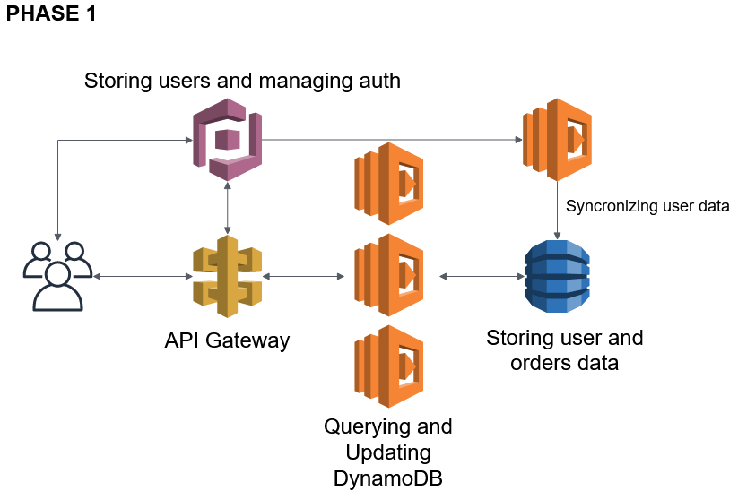
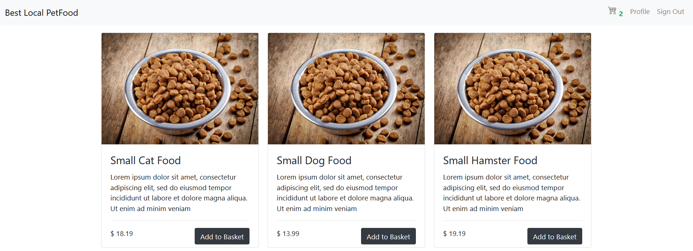
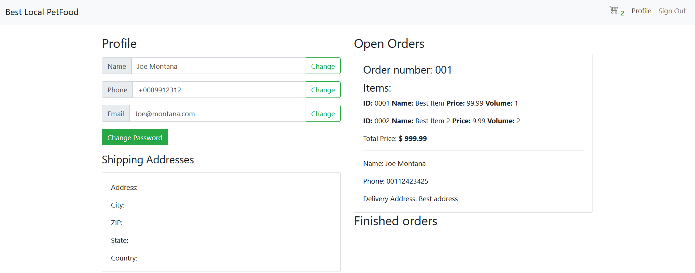
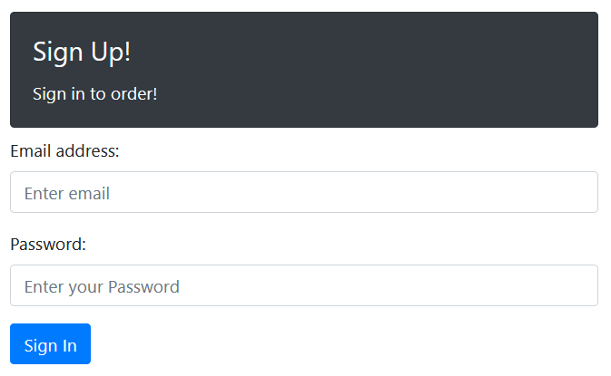
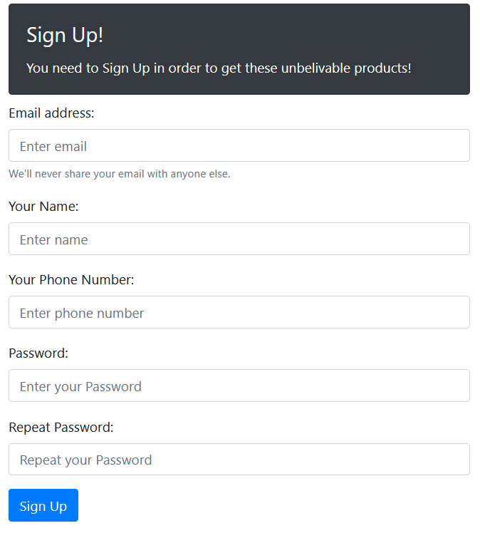
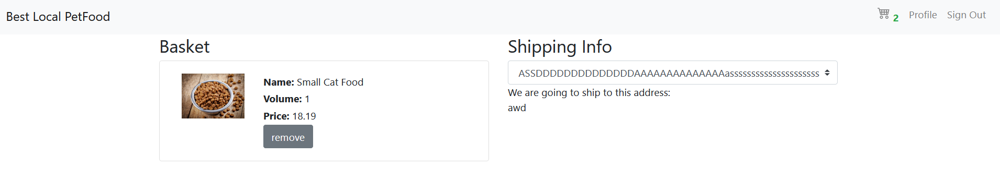
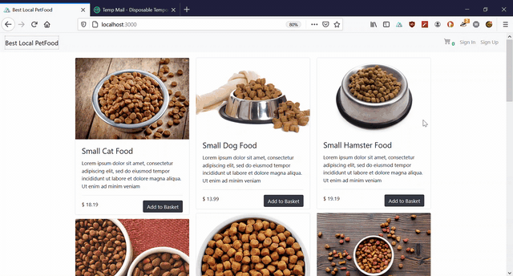

# AWS Serverless Webshop Workshop
The Project's aim is to showcase how to use and manage AWS resources with an Infrastructure as a Code setup, using `aws-cdk`. The product would be represent by a solution/proof of concept for a webshop, using CRUD operations (not more advanced concept or patterns, which would be more ideal in recent years).

## AWS BACKEND Infrastructure as code build INSTRUCTIONS!!!!
[aws-backend instructions](./aws-backend/README.md)
!!You should definitely check this out, this is the heart and soul of the project!!

The AWS Resources:
- DynamoDB
- Cognito
- IAM
- API Gateway (HTTP API)
- Lambda
- Amplify

## AWS BACKEND Infrastructure as code implementation
[aws-backend folder](./aws-backend)

## AWS BACKEND Infrastructure as code build INSTRUCTIONS!!!!
[aws-backend instructions](./aws-backend/README.md)
!!You should definitely check this out, this is the heart and soul of the project!!

## FRONT END implementation (Backed by NUXT and AWS Amplify)
[website folder](./website)

## Requirements / User Stories
- As an owner, I want to sell pet-food in my local community online, in order to increase the profit.
- As a developer, I want to use serverless technologies, so I don't need to worry about maintaining the infrustructure, scaling, and overpaying for services being in an IDLE state.
- As a developer, I want to use an Infrastructure as a Code solution, to deploy the resources, in order to speed up the development, and have a code representation of the solution
- As a customer, I want to order goods from the website
- As a customer, I want to order multiple items from the website with the same order
- As a customer, I want to see, and look at my profile
- As a customer, I want to add multiple delivery options to my profile
- As a customer, I want to login and logout securely from the website
- As a developer, I want to store securely the user credentials

## Backend Structure

## The Web Application Design

Index page

Profile page

Signin page

Signup page

Checkout page

## Front End Component
The solution contains the front-end part, but the project focus on more how to implement the neccessary aws resources, rather than having the best design. The Front End Stack is based on `Nuxt.js` (Vue Framework), and its staticly hosted. For the first iteration of the project the available products are contained by the nuxt plugin `$context api`, (we can argue about what is the point where we need to seperate the products from the front-end and add to a CMS, but for simplicity and for the demo reasons now I keep it together). Besides `nuxt.js` the project uses `aws-amplify` to authenicate and manage users, and `bootstrap` to make a better designed prototype.

### Defining Queries

(methods regarding the signup and login and user data (phone, mail, name, password) are handled by cognito/amplify)

- Get User Data
- Get User Shipping Addresses
- Get User Orders
- Post Shipping Address
- Delete Shipping Address
- Post Order

### DynamoDB data model

Signing up a new user triggers a `Lambda` to create a new user record in the dedicated `DynamoDB` table, and copy the user data. (In our use case it neccessary because the partition key is the user-id, we could have created the partition key when we create the first order, or the first address, but for making the application future proof, (if we want to query all the users, or all of their data) we add this additional Lambda trigger)

Note that, with DynamoDB we can use one table for our purpuse, we don't need to normalize the dataset, With the following data model we can achive that we keep the individual user related data to close together on the same partition. (If we need a custom query to retrive for example all of the open orders, we would make an GSI(Global Secondary Index) on the order status field, which would automatically filter out all of the records that are not part of the orders and, and query for the open orders in the created index.)

##### Base Data Properties

|Partition Key|Sort Key|
|---|---|
|S:PK|S:SK|

##### Attributes with the Customers data

|Partition Key|Sort Key|Attribute 1|Attribute 2|Attribute 3|
|---|---|---|---|---|
|S:PK|S:SK|S:customer_email|S:customer_phone_number|S:customer_name|

The PK pattern is like #customer#{id}, the SK pattern is like #profile

##### Attributes with the Orders data

|Partition Key|Sort Key|Attribute 4|Attribute 5|Attribute 6|Attribute 7|Attribute 8|Attribute 9|Attribute 10|
|---|---|---|---|---|---|---|---|---|
|S:PK|S:SK|S:order_delivery_address|S:order_delivery_name|S:order_delivery_phone_number|List{Map}:order_items|S:order_id|N:order_total_price|S:order_status|

The PK pattern is like #customer#{id}, the SK pattern is like #order#{id}

##### Attributes with the Shipping address Data
(Note here we can have multiple options how to store the delivery address, we can seperate it into multiple fields, or overload the SK with the fields, or we can store the fields in a map, but here I am going to stick with a string)

|Partition Key|Sort Key|Attribute 11|
|---|---|---|
|S:PK|S:SK|S:delivery_address|

The PK pattern is like #customer#{id}, the SK pattern is like #delivery_address#{id}

### DynamoDB Queries based on the Query requirement (sudo like style)
- Get Customer Data: `Query Where PK = #customer#{id} AND SK = #profile`
- Get Customer Shipping Addresses: `Query Where PK = #customer#{id} AND SK begins_with #delivery_address#`
- Get Customer Shipping Address: `Query Where PK = #customer#{id} AND SK = #delivery_address#{id}` (but we would not need this one)
- Get Customer Ordrers: `Query Where PK = #customer#{pk} AND SK begins_with #order#`
- Get all the user related data with one query: `Query Where PK = #customer#{pk}`

### API Gateway - Endpoints
|method|resource|
|---|---|
|GET|customer/profile|
|GET|customer/orders|
|GET|customer/shipping-addresses|
|POST|customer/orders|
|POST|customer/shipping-addresses|
|DELETE|customer/shipping-addresses|

## Proof of Concept

User Registration

Ordering

